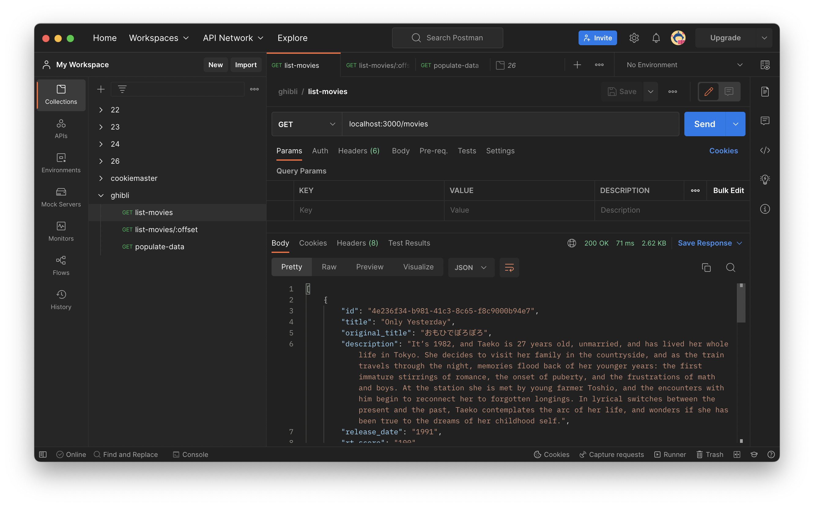
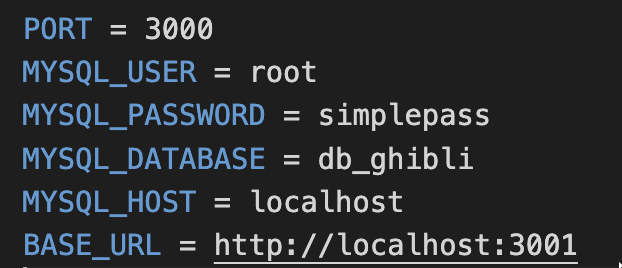

# studio-ghibli

Projeto desenvolvido para o consumo da API do Studio Ghibli, salvar os dados em um banco de dados e disponibilizar em um endpoint de forma paginada.

# dependências

Para executar o projeto, deve se atentar aos seguintes requisitos: NodeJS e MySQL instalado.

## postman

Para testar o projeto, recomendo a utilização do _postman_ ou similar.



# orientação

É essencial a edição e configuração do arquivo _.env.example_



# iniciar

Para a inicialização do projeto, deve-se executar `npm i`

Após a instação dos pocates, segue a lista de comandos e a suas finalidades :

- `npm run start` : iniciar o projeto
- `npm run dev` : iniciar o projeto em modo de desenvolvimento
- {

  `npm run test`

  `npm run test:verbose`

  `npm run test:unit`

  `npm run test:staged`

  `npm run test:ci`

  } : comandos usados para executar os testes

# banco

O banco terá uma única tabela e que pode ser criada apartir do seguinte script:

```sql
DROP SCHEMA IF EXISTS db_ghibli;
CREATE SCHEMA IF NOT EXISTS db_ghibli DEFAULT CHARACTER SET utf8 COLLATE utf8_general_ci;
USE db_ghibli;

CREATE TABLE movies (
	id CHAR(36) NOT NULL PRIMARY KEY,
	title VARCHAR(255) NOT NULL,
	original_title VARCHAR(255),
	description TEXT NOT NULL,
	release_date VARCHAR(10) NOT NULL,
	rt_score VARCHAR(4)
);
```

# rotas

Existem duas rotas no projeto: 
- `/movies` : serve para acessar os filmes que se encontram no banco de forma paginada (pode se usar `/movies/:offset` para especificar a página)
- `/populate` : serve para acessar a API do Stugio Ghibli e popular/atualizar o banco de dados

# bibliotecas

O projeto usa o `ESLint` para encontrar bugs, áreas potencialmente problemáticas, estilos de codificação ruins e questões de estilo.

Para testes, é utilizado a biblioteca `Jest`.

Também foi instalada a biblioteca `git-commit-msg-linter` para padronizar os `commit's` conforme o [Conventional Commits](https://www.conventionalcommits.org/en/v1.0.0/).

E para garantir a aplicação dos testes, `ESLint` e o `commit-msg-linter`, foi instalada e configurada o `Husky`, tanto para o `commit` quando para o `push`.
